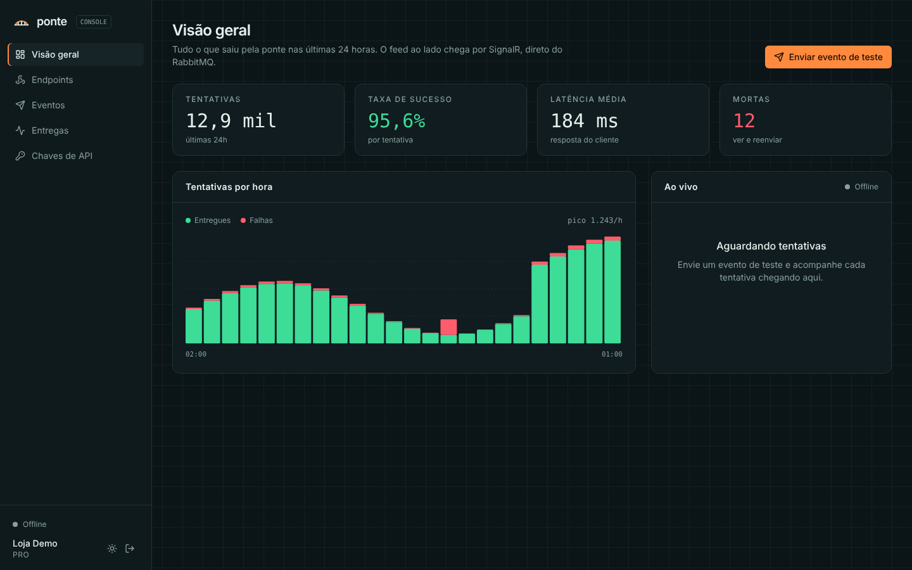
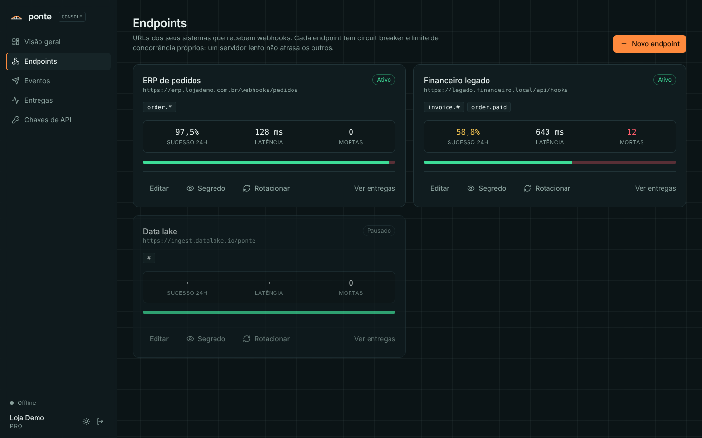
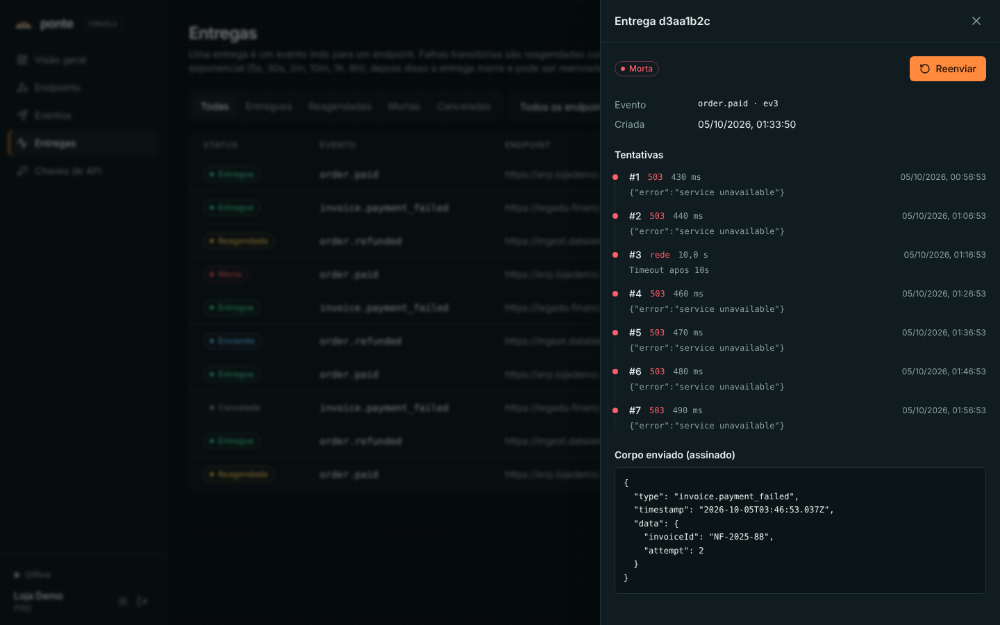
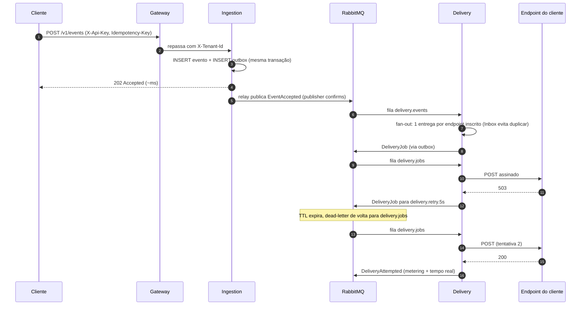

# Ponte

**Plataforma de entrega confiável de webhooks.** Seu sistema publica um evento uma vez; a Ponte entrega para todos os endpoints inscritos, com assinatura, retry exponencial, circuit breaker por endpoint, DLQ, replay e um painel em tempo real.

Microsserviços em **.NET 8** + console em **React/TypeScript**, conversando por **RabbitMQ** (filas e tópicos), com **PostgreSQL** e **SQL Server** (um banco por serviço), pronto para rodar com `docker compose` e para subir na **AWS** com Terraform.




<table>
  <tr>
    <td></td>
    <td></td>
  </tr>
  <tr>
    <td align="center"><sub>Endpoints: padrões de evento, saúde em 24h, segredo e rotação</sub></td>
    <td align="center"><sub>Entrega: cada tentativa, status HTTP, latência e corpo assinado</sub></td>
  </tr>
</table>

---

## Por que este projeto existe

Todo SaaS em algum momento precisa avisar os sistemas dos clientes: "o pedido foi pago", "a nota foi emitida". A primeira versão é um `HttpClient.PostAsync` dentro do request. Depois vêm os problemas:

- o servidor do cliente cai e os eventos se perdem;
- um cliente lento segura threads e atrasa todos os outros;
- o retry manda o mesmo evento duas vezes e o cliente cobra em dobro;
- alguém cadastra `http://169.254.169.254` como endpoint e lê as credenciais da sua AWS (SSRF);
- ninguém sabe dizer se o evento X chegou ou não.

A Ponte resolve isso como infraestrutura (no estilo de Svix e Hookdeck): a API responde `202` em milissegundos e todo o trabalho pesado acontece de forma assíncrona, resiliente e observável.

## O que ela faz

| | |
|---|---|
| **Ingestão idempotente** | `POST /v1/events` com `Idempotency-Key`. Requisições repetidas (até simultâneas) viram um único evento. |
| **Fan-out por assinatura** | Endpoints se inscrevem com padrões AMQP: `order.*`, `invoice.#`, `#`. |
| **Assinatura Standard Webhooks** | Headers `webhook-id`, `webhook-timestamp`, `webhook-signature` (HMAC-SHA256), validáveis com qualquer lib oficial da spec. |
| **Rotação de segredo sem downtime** | Por 24h as entregas saem assinadas com o segredo novo **e** o antigo. |
| **Retry exponencial** | 5s, 30s, 2m, 10m, 1h, 6h (cerca de 7h30 de cobertura), respeitando `Retry-After`. 4xx não repete. |
| **Circuit breaker por endpoint** | Endpoint fora do ar para de ser chamado por 30s; volta com uma requisição de teste. |
| **Bulkhead por endpoint** | Limite de entregas simultâneas: um cliente lento não sequestra os workers. |
| **DLQ e replay** | Entregas que esgotam as tentativas ficam "mortas" e podem ser reenviadas (uma ou todas). |
| **Proteção SSRF** | Validação no cadastro **e** no momento da conexão (resistente a DNS rebinding). |
| **Tempo real** | Cada tentativa aparece no console via SignalR, em todas as réplicas. |
| **Metering** | Uso agregado por hora no SQL Server (base para cobrança e para o dashboard). |

## Arquitetura

```mermaid
flowchart LR
  client[Sistema do cliente] -->|POST /v1/events| gw
  console[Console React] -->|REST + SignalR| gw

  subgraph edge [Borda]
    gw[Gateway<br/>YARP, auth por API key,<br/>rate limit por tenant]
  end

  gw --> ing[Ingestion API]
  gw --> del[Delivery API + workers]
  gw --> mgmt[Management API]

  ing -->|evento + outbox<br/>1 transação| pg1[(PostgreSQL<br/>ponte_ingestion)]
  del --> pg2[(PostgreSQL<br/>ponte_delivery)]
  mgmt --> sql[(SQL Server<br/>ponte_management)]

  ing -. EventAccepted .-> mq{{RabbitMQ}}
  mgmt -. EndpointUpserted .-> mq
  mq -. delivery.events / delivery.endpoints .-> del
  del -. DeliveryJob + filas de retry TTL .-> mq
  del -->|POST assinado| ext[Endpoints dos clientes]
  del -. DeliveryAttempted .-> mq
  mq -. fila: management.metering .-> mgmt
  mq -. tópico: fila exclusiva por instância .-> mgmt
  mgmt -->|SignalR| console
```

| Serviço | Responsabilidade | Banco |
|---|---|---|
| **Gateway** | Ponto único de entrada. Valida API key (com cache), injeta `X-Tenant-Id`, rate limit por tenant (token bucket), roteia com health check ativo. | sem estado |
| **Ingestion** | Recebe eventos no caminho quente: valida, aplica idempotência, grava evento + outbox e responde 202. | PostgreSQL |
| **Delivery** | Fan-out, envio HTTP assinado, retry, circuit breaker, bulkhead, DLQ, replay. Mantém uma réplica local dos endpoints. | PostgreSQL |
| **Management** | Tenants, endpoints, API keys, metering e o hub SignalR. Fonte da verdade dos endpoints. | SQL Server |
| **Console** | Dashboard, endpoints, eventos, entregas com timeline de tentativas, chaves de API. | |

Detalhes de topologia, modelo de dados e cenários de falha em [`docs/architecture.md`](docs/architecture.md). As decisões estão registradas em [`docs/adr`](docs/adr).

### Uma entrega, passo a passo



## Mapa de competências

Onde cada requisito aparece no código:

| Requisito | Onde está |
|---|---|
| **.NET** | .NET 8, Minimal APIs, EF Core 8, `BackgroundService`, `IMeterFactory`, `TimeProvider`, Problem Details, rate limiting nativo. |
| **React e TypeScript** | `web/ponte-console`: React 18, TS estrito, TanStack Query (cursor infinito), React Router, SignalR, Tailwind v4, Vitest + Testing Library. |
| **Microsserviços** | 4 serviços com banco próprio, comunicação assíncrona por eventos, API Gateway, réplica local via event-carried state transfer. |
| **RabbitMQ** | Exchanges topic/direct, quorum queues, DLX, filas de retry com TTL, publisher confirms, ack manual, prefetch, `x-delivery-limit`. |
| **Mensageria: fila e tópico** | Fila (competing consumers): `delivery.jobs`, `management.metering`. Tópico (pub/sub): `ponte.bus` com fila exclusiva por instância para o SignalR. |
| **PostgreSQL** | `FOR UPDATE SKIP LOCKED`, `jsonb`, índice parcial, índice único filtrado, concorrência otimista com `xmin`, identity, keyset pagination. |
| **SQL Server** | `MERGE ... WITH (HOLDLOCK)` para upsert atômico, `READPAST/UPDLOCK` no outbox, `rowversion`, primitive collections do EF Core 8 (JSON). |
| **Orientação a objetos** | Agregados com estado encapsulado (`WebhookDelivery`, `WebhookEndpoint`), construtores privados, transições só por métodos de domínio. |
| **Injeção de dependência** | Tudo registrado no container nativo: handlers por escopo, decorators manuais, typed `HttpClient`, Options pattern, hosted services. |
| **Design patterns** | Tabela abaixo. |
| **Código robusto, testável e validado** | Result pattern, validação na borda e no domínio, `TimeProvider` injetável, 4 projetos de teste (unitário + Testcontainers), CI. |
| **Alta disponibilidade e performance** | Seção "Alta disponibilidade e performance" abaixo. |
| **Cloud (AWS)** | `infra/terraform`: ECS Fargate em 3 AZs, Amazon MQ (cluster RabbitMQ), RDS PostgreSQL e SQL Server Multi-AZ, ALB, CloudFront, Secrets Manager, autoscaling pela fila. |

## Design patterns

| Padrão | Onde | Por quê |
|---|---|---|
| **Transactional Outbox** | `BuildingBlocks/Persistence/Outbox.cs`, `OutboxRelay.cs` | Gravar no banco e publicar no broker sem "dual write". |
| **Idempotent Consumer (Inbox)** | `Inbox<TContext>` | At-least-once no broker, efeito exactly-once no banco. |
| **Competing Consumers** | `ConsumerDefinition.ForQueue` | Escala horizontal dos workers. |
| **Publish/Subscribe** | `ConsumerDefinition.ForEachInstance` | Todas as réplicas do Management recebem o evento de tempo real. |
| **Retry com backoff + Dead Letter** | `Topology.RetryTiers`, `TopologyDeclarer` | Filas de espera com TTL por degrau, sem bloqueio de cabeça de fila. |
| **Circuit Breaker** (com **State**) | `EndpointCircuitBreaker.cs` | Estados Closed, Open e HalfOpen como classes; transições explícitas. |
| **Bulkhead** | `EndpointBulkhead.cs` | Isolamento de falha entre tenants. |
| **Strategy** | `IRetryPolicy`, `IOutboxSqlDialect` | Política de retry e dialeto SQL trocáveis. |
| **Decorator** | `InstrumentedWebhookSender` | Métricas sem poluir o envio HTTP. |
| **Specification** | `EventTypePattern` | Regra de assinatura de eventos isolada e testável (idêntica no front). |
| **Factory / Builder** | `SsrfSafeHandlerFactory`, `ConsumerDefinition` (fluente) | Criação de objetos complexos em um lugar só. |
| **Result** | `Result<T>`, `Error` | Falhas de negócio como valor, convertidas em Problem Details. |
| **Repository + Unit of Work** | `DbContext` por serviço | Um `SaveChanges` = uma transação (negócio + outbox + inbox). |
| **API Gateway / Gateway Offloading** | `Ponte.Gateway` | Auth e rate limit uma vez, na borda. |
| **Database per Service** | 3 bancos, 2 motores | Autonomia e falhas isoladas. |
| **Event-carried State Transfer** | `EndpointUpserted` com `Version` | Delivery funciona mesmo com o Management fora do ar. |
| **Cache-aside** | `EndpointDirectory`, `ApiKeyResolver` | Menos consultas no caminho quente. |
| **Lease + concorrência otimista** | `WebhookDelivery.TryClaim` + `xmin` | Duas cópias do mesmo job nunca disparam dois POSTs. |

## Alta disponibilidade e performance

**Caminho quente curto.** A ingestão faz uma única ida ao banco (evento + outbox na mesma transação) e responde `202`. Publicação, fan-out e HTTP saem da latência do cliente.

**Nada de estado na memória que não possa ser perdido.** Toda transição é persistida antes do ack. Se uma instância morre no meio de uma entrega, a mensagem volta para a fila e o lease expira.

**Escala horizontal real.**
- Relay do outbox com `FOR UPDATE SKIP LOCKED` (Postgres) e `UPDLOCK, READPAST` (SQL Server): N réplicas sem publicar em dobro. Há um teste com 3 relays concorrentes provando isso.
- Workers como competing consumers com `prefetch` e `ConsumerDispatchConcurrency` configuráveis.
- Na AWS, o Delivery escala pelo backlog da fila `delivery.jobs`, não pela CPU.

**Isolamento de falhas.** Circuit breaker e bulkhead por endpoint; rate limit por tenant no gateway. Um cliente problemático não degrada os outros.

**Broker e bancos redundantes.** Quorum queues (Raft) no RabbitMQ, cluster Amazon MQ em 3 AZs, RDS Multi-AZ, NAT por AZ, ECS espalhado em 3 AZs com deploy circuit breaker e rollback automático.

**Degradação graciosa.** Se o Management cair, chaves já vistas continuam válidas (cache no gateway) e o Delivery continua entregando com a réplica local dos endpoints. Ingestão e entrega não dependem dele.

**Eficiência.** `AddDbContextPool`, keyset pagination (custo constante em qualquer página), índices parciais e filtrados, publicação em lote com uma única espera de confirmação, `SocketsHttpHandler` com pool de conexões, Server GC e Tiered PGO na imagem.

**Observabilidade.** OpenTelemetry (traces + métricas) com o `traceparent` propagado pelo header da mensagem: um trace atravessa HTTP, outbox, RabbitMQ e worker. Health checks separados de liveness e readiness.

## Como rodar

Pré-requisito: Docker.

```bash
git clone https://github.com/viniviti/ponte.git
cd ponte
docker compose up --build
```

| | |
|---|---|
| Console | http://localhost:3000 |
| Gateway | http://localhost:5100 |
| Swagger | http://localhost:5101/swagger (ingestion), http://localhost:5103/swagger (management) |
| RabbitMQ | http://localhost:15672 (`ponte` / `ponte`) |
| Jaeger (traces) | http://localhost:16686 |
| Echo receiver | http://localhost:5199/received |

O Management cria um tenant de demonstração com três endpoints apontando para o **echo receiver**, que simula clientes reais: um instável (15% de falha), um lento e quebrado (60% de falha, 600 ms) e um data lake que aceita tudo.

**API key de demonstração:** `pk_test_ponte_demo_key_0000000000000000`

Rodando fora do Docker (para debugar): suba só a infraestrutura com `docker compose up postgres sqlserver rabbitmq`, rode cada serviço com `dotnet run` (portas 5100 a 5103 e 5199) e o console com `npm run dev` em `web/ponte-console`.

## Tour de 5 minutos

```bash
KEY=pk_test_ponte_demo_key_0000000000000000

# 1. Envie um evento
curl -i http://localhost:5100/v1/events \
  -H "X-Api-Key: $KEY" -H "Content-Type: application/json" \
  -H "Idempotency-Key: pedido-1042" \
  -d '{"eventType":"order.paid","payload":{"orderId":"PED-1042","total":389.90}}'
# HTTP/1.1 202 Accepted

# 2. Repita a mesma requisição: mesmo id, header Idempotent-Replayed: true

# 3. Veja as entregas (e as reagendadas)
curl -s "http://localhost:5100/v1/deliveries?status=scheduled" -H "X-Api-Key: $KEY"

# 4. Gere carga e acompanhe no console e no RabbitMQ
for i in $(seq 1 200); do
  curl -s -o /dev/null http://localhost:5100/v1/events -H "X-Api-Key: $KEY" \
    -H "Content-Type: application/json" -d '{"eventType":"invoice.payment_failed","payload":{"n":'$i'}}'
done

# 5. Reenvie tudo que morreu
curl -X POST http://localhost:5100/v1/deliveries/replay-dead -H "X-Api-Key: $KEY"
```

No console, a tela **Visão geral** mostra cada tentativa chegando ao vivo; em **Entregas** dá para abrir a timeline de tentativas e o corpo exato que foi assinado.

## Validando a assinatura do seu lado

A assinatura segue a spec [Standard Webhooks](https://www.standardwebhooks.com/). Exemplo sem dependências:

```csharp
// C#
static bool IsValid(string secret, string id, string timestamp, string body, string signatureHeader)
{
    var key = Convert.FromBase64String(secret.Replace("whsec_", ""));
    var expected = "v1," + Convert.ToBase64String(HMACSHA256.HashData(key, Encoding.UTF8.GetBytes($"{id}.{timestamp}.{body}")));
    return signatureHeader.Split(' ').Any(s => CryptographicOperations.FixedTimeEquals(
        Encoding.UTF8.GetBytes(s), Encoding.UTF8.GetBytes(expected)));
}
```

```ts
// Node / TypeScript
import { createHmac, timingSafeEqual } from 'node:crypto'

export function isValid(secret: string, id: string, timestamp: string, body: string, header: string) {
  const key = Buffer.from(secret.replace('whsec_', ''), 'base64')
  const expected = 'v1,' + createHmac('sha256', key).update(`${id}.${timestamp}.${body}`).digest('base64')
  return header.split(' ').some((s) => s.length === expected.length && timingSafeEqual(Buffer.from(s), Buffer.from(expected)))
}
```

Rejeite também timestamps com mais de 5 minutos de diferença (proteção contra replay) e deduplique pelo `webhook-id`: a entrega é at-least-once.

## Testes

```bash
dotnet test --filter "Category!=Integration"   # unitários, rápidos
dotnet test --filter "Category=Integration"    # sobe PostgreSQL, SQL Server e RabbitMQ com Testcontainers
cd web/ponte-console && npm test               # Vitest + Testing Library
k6 run tests/load/ingest.js                    # carga na ingestão (k6)
```

Alguns testes que valem a leitura:

- **3 relays de outbox concorrentes** publicam 60 mensagens sem nenhuma duplicata (`OutboxRelayTests`).
- **10 requisições simultâneas** com a mesma `Idempotency-Key` geram um único evento (`IngestionApiTests`).
- **Mensagem na fila de 5s** volta sozinha para `delivery.jobs` quando o TTL expira (`RabbitMqTopologyTests`).
- **Job duplicado** não dispara dois POSTs; **circuito aberto** adia sem gastar tentativa (`DeliveryFlowTests`).
- **MERGE concorrente** no SQL Server não perde incrementos; redelivery não conta duas vezes (`ManagementSqlServerTests`).
- **Vetor oficial** da spec Standard Webhooks (`StandardWebhookTests`).

## Deploy na AWS

```bash
cd infra/terraform
terraform init
terraform apply -var-file=example.tfvars
```

Provisiona VPC em 3 AZs, ECS Fargate (com Cloud Map, autoscaling por CPU e pela fila do Amazon MQ, deploy circuit breaker), Amazon MQ for RabbitMQ em cluster Multi-AZ, RDS PostgreSQL e SQL Server Multi-AZ, ALB com TLS 1.3, Secrets Manager para as connection strings, ECR e CloudFront + S3 para o console. O CI publica as imagens no GHCR a cada push na `main`.

## Estrutura

```
ponte/
├── src/
│   ├── BuildingBlocks/
│   │   ├── Ponte.Contracts/        # eventos de integração e topologia do RabbitMQ
│   │   └── Ponte.BuildingBlocks/   # mensageria, outbox/inbox, segurança, hosting
│   ├── Gateway/Ponte.Gateway/      # YARP + auth + rate limit
│   ├── Services/
│   │   ├── Ingestion/              # PostgreSQL
│   │   ├── Delivery/               # PostgreSQL
│   │   └── Management/             # SQL Server + SignalR
│   ├── Tools/Ponte.EchoReceiver/   # cliente simulado para demo e carga
│   └── Dockerfile                  # um Dockerfile para todos os serviços
├── web/ponte-console/              # React + TypeScript
├── tests/                          # xUnit + Testcontainers, k6
├── infra/terraform/                # AWS
└── docs/                           # arquitetura e ADRs
```

## Próximos passos

- Ordenação por chave (entregas FIFO por `orderingKey`) com consistent hashing exchange.
- Transformações de payload por endpoint (templates).
- Portal do cliente final embutível (white label).
- OIDC (Amazon Cognito) no console no lugar da API key.
- Migrations versionadas com `dotnet ef migrations bundle` no pipeline.

## Licença

MIT. Feito por [Vinícius Viti](https://github.com/viniviti) · [TERMINALz](https://terminalz.com.br).
