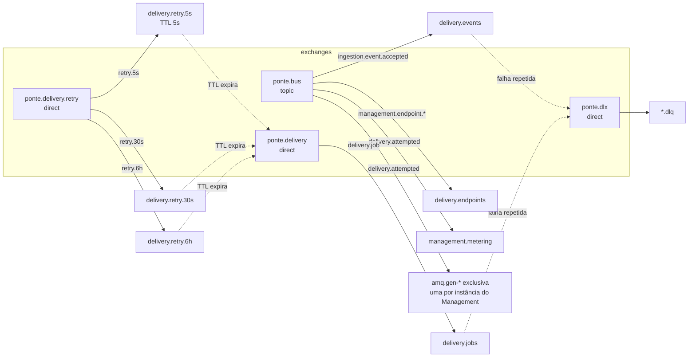

# Arquitetura da Ponte

## Topologia do RabbitMQ

Toda a topologia é declarada em um único lugar (`Ponte.Contracts/Topology.cs`) e cada serviço a declara inteira no startup. Declarações no RabbitMQ são idempotentes, então isso elimina a corrida clássica de deploy em que um serviço publica antes de a fila do consumidor existir.

| Fila | Tipo | Consumidor | Padrão |
|---|---|---|---|
| `delivery.events` | quorum | Delivery (fan-out) | competing consumers |
| `delivery.endpoints` | quorum | Delivery (réplica de endpoints) | competing consumers |
| `delivery.jobs` | quorum | Delivery (envio HTTP) | competing consumers |
| `delivery.retry.{5s..6h}` | quorum, TTL, sem consumidor | | fila de espera, dead-letter de volta para `delivery.jobs` |
| `management.metering` | quorum | Management | competing consumers |
| `amq.gen-*` | exclusiva, auto-delete | cada instância do Management | pub/sub (fan-out para o SignalR) |
| `*.dlq` | quorum | operação | dead letter (mensagem envenenada) |

**Por que filas por degrau e não TTL por mensagem?** Com TTL por mensagem, o RabbitMQ só expira a mensagem da cabeça da fila. Uma mensagem de 6h na frente segura uma de 5s atrás dela. Com uma fila por degrau, todas as mensagens de uma fila têm o mesmo TTL e expiram em ordem.

**Dois tipos de falha, dois mecanismos.**
- Falha **do endpoint do cliente** (timeout, 503) é regra de negócio: vira uma tentativa registrada e um job na fila de espera certa.
- Falha **do nosso processamento** (banco fora, bug) vira `nack`. Nas quorum queues o broker conta as entregas e, ao passar de `x-delivery-limit`, manda para a `.dlq`.

## Garantias de entrega

| Etapa | Garantia | Como |
|---|---|---|
| API para banco | atômica | evento + outbox no mesmo `SaveChanges` |
| Banco para broker | at-least-once | relay com publisher confirms; marca como processado só depois do confirm |
| Broker para consumidor | at-least-once | ack manual após o commit |
| Efeito no banco | exactly-once | Inbox (`processed_messages`, PK `message_id + consumer`) + índice único `(event_id, endpoint_id)` |
| POST para o cliente | at-least-once | lease + `xmin` evitam duplicata concorrente; o cliente deduplica por `webhook-id` |

## Modelo de dados

### PostgreSQL, `ponte_ingestion`

| Tabela | Destaques |
|---|---|
| `events` | `payload jsonb`, `sequence` identity para keyset, índice único filtrado `(tenant_id, idempotency_key) WHERE idempotency_key IS NOT NULL`, `payload_hash` para detectar reuso de chave com outro corpo |
| `outbox_messages` | índice parcial `WHERE processed_at IS NULL` (o relay só enxerga o pendente) |

### PostgreSQL, `ponte_delivery`

| Tabela | Destaques |
|---|---|
| `deliveries` | `body text` (bytes exatos assinados), `status`, `lease_until`, `xmin` como token de concorrência, índices `(tenant_id, sequence DESC)` e `(tenant_id, status, sequence DESC)` |
| `delivery_attempts` | histórico de cada tentativa (status HTTP, duração, trecho da resposta) |
| `endpoint_replicas` | réplica local alimentada por eventos, com `source_version` e tombstone |
| `outbox_messages`, `processed_messages` | outbox e inbox |

### SQL Server, `ponte_management`

| Tabela | Destaques |
|---|---|
| `tenants`, `api_keys` | `key_hash` (SHA-256) com índice único, nunca a chave em texto |
| `endpoints` | `event_types` como JSON (primitive collection do EF Core 8), `row_version rowversion`, `version` monotônico, segredo anterior com expiração |
| `usage_hourly` | PK `(tenant_id, hour_bucket, endpoint_id)`, atualizada com `MERGE ... WITH (HOLDLOCK)` |

## O que acontece se...

| Cenário | Comportamento |
|---|---|
| O RabbitMQ cai | A ingestão continua aceitando eventos (vão para o outbox). Quando o broker volta, o relay publica o acumulado. Consumidores reconectam sozinhos (automatic recovery). |
| O Management cai | Chaves já vistas seguem válidas (cache de 60s no gateway). O Delivery continua entregando com a réplica local. Só o CRUD e o tempo real param. |
| Uma instância do Delivery morre no meio do POST | A mensagem não recebeu ack e volta para a fila. A entrega está `InFlight` com lease: outra instância reagenda até o lease vencer e então assume. |
| O relay publica e cai antes do commit | A mensagem sai de novo. O consumidor descarta pelo Inbox. |
| O servidor do cliente cai por 2 horas | Retries em 5s, 30s, 2m, 10m, 1h. O circuit breaker abre depois de 5 falhas seguidas e adia as demais entregas sem gastar tentativa. Quando volta, o half-open testa com uma requisição e reabre o fluxo. |
| Um cliente responde em 9s | O bulkhead limita as entregas simultâneas para aquele endpoint; os outros tenants seguem com workers livres. |
| Duas pessoas editam o mesmo endpoint | `rowversion` detecta e a segunda recebe `409 endpoint_modified`. |
| Mensagens de endpoint chegam fora de ordem | `version` monotônico: a réplica ignora versões antigas; tombstone impede ressuscitar endpoint removido. |
| Alguém cadastra `https://meu-dominio.com` que resolve para `10.0.0.5` | O `ConnectCallback` resolve o DNS, valida o IP e conecta naquele IP: bloqueado mesmo que o DNS mude depois do cadastro. |

## Observabilidade

- **Traces:** OpenTelemetry em todos os serviços. O `traceparent` é gravado no outbox e propagado no header da mensagem, então um único trace mostra: `POST /v1/events` no gateway, a ingestão, a publicação, o fan-out e cada tentativa HTTP. No compose, abra o Jaeger em http://localhost:16686.
- **Métricas:** `ponte.events.accepted`, `ponte.events.idempotent_replays`, `ponte.delivery.attempts` (por resultado e classe de status), `ponte.delivery.duration` (histograma), `ponte.delivery.fanned_out`, `ponte.delivery.deferred` (por motivo), além das métricas de ASP.NET Core, HttpClient e runtime.
- **Health checks:** `/health/live` (processo vivo) e `/health/ready` (banco e broker acessíveis). O YARP e o ALB usam o readiness para tirar instâncias doentes da rotação.
